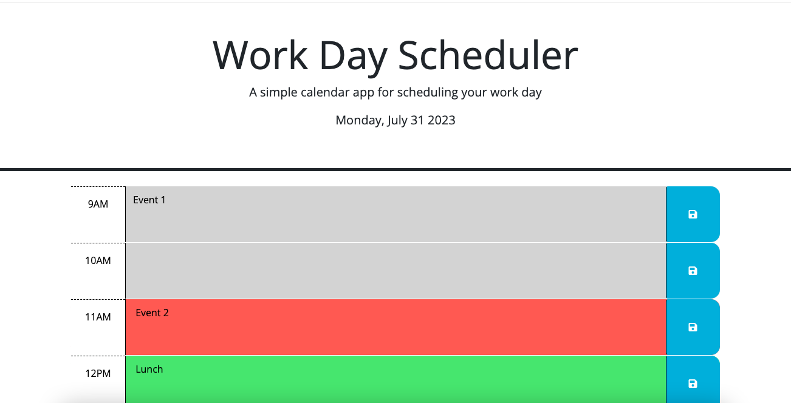

# Work_Day_Scheduler

## Description

This project was created to modify an existing Work Day Scheduler application that allows a user to save events for each hour of a typical working day (9am–5pm). 

This app runs in the browser, and features dynamically updated HTML and CSS powered by jQuery.

Events added and saved in this daily planner will persist even when the page is refreshed.

## Installation

N/A

## Usage

The URL to the page is https://lmerrico.github.io/Work_Day_Scheduler/

Open the planner and the current day will display at the top.

Get a confirm when an event is added and saved.

Get an alert when the time block is empty.

## License

Please refer to the LICENSE in the repository.

## Note

This project was created based on reviewing activities from the previous classes at bootcamp and Google searches.
